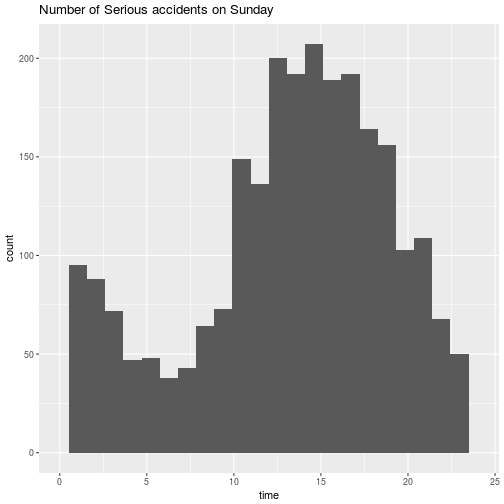

Road Safety in the UK
========================================================
author: Michal Svoboda
date: 6.12.2016
autosize: true

Data
========================================================

The application uses data about road accidents for the year 2015 from the dataset Road Safety Data provided by Brittish ministerial Department For Transport. For more information see <https://data.gov.uk/dataset/road-accidents-safety-data>.

App
========================================================
The application first loads the data stored in a csv file. Then columns featuring gps coordinates of the accidents, their severity, weekday and time are selected. 
There are two functionalities that can be used:

- map
- histogram showing distribution of the accidents over the day

Interesting results
========================================================

Interpretation
========================================================
See that values early in the morning? Could this be drunken drivers returning home?

Go ahead and try to find some more interesting patterns using the application!
